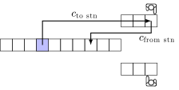

Cheapest place
==============

Solve the :ref:`small system <small-test-system>` with cheapest-place algorithm.

For this tutorial we need following modules:

.. literalinclude:: ../../examples/use-cheapest-place.py
    :start-at: from prp.solvers.simple
    :end-at: import prp.utils

Parameters
----------

We define paths to JSON files of the small warehouse system

.. literalinclude:: ../../examples/use-cheapest-place.py
    :start-at: LAYOUT_FILE =
    :end-at: DEPARTURES_FILE =

and store the solution to a JSON file:

.. literalinclude:: ../../examples/use-cheapest-place.py
    :start-at: SOLUTION_FILE =
    :lines: 1

Calculate
---------

Load the warehouse model from JSON files.

.. literalinclude:: ../../examples/use-cheapest-place.py
    :start-at: def load_problem():
    :end-at: warehouse = load_problem()

.. _costs_type:

.. _costs_figure:

    Components of the costs.

When a cheapest-algorithm chooses a place it selects a place with the lowest costs. It makes only short term decision and ignores consequences for the future decisions. Before we can use this algorithm we need to decide what kind of *costs* we want to compare:

* For costs in only one direction -- to storage -- use *CostsType.FROM_STATION_ONLY*. On the  :ref:`costs figure <costs_figure>` they are marked as :math:`c_{\text{from stn}}`. The *NearestPod* algorithm in RAWSim-O uses this type of costs. They are easy to calculate and they work when we cannot predict the future departure of the pod.

* For costs in both directions -- to storage and from storage -- use *CostsType.DECISION*. These costs represents the costs full costs for a single decision.  On the  :ref:`costs figure <costs_figure>` these costs correspond to the sum :math:`c_{\text{from stn}}+c_{\text{to stn}}`. You can use these costs only you know the future departure of the pod.

In the small test system, the cheapest place will return the same results for both types of the costs. In fact, the small test system were deliberately constructed to have this property. But, in general, the cheapest-place returns different results for different type of costs.

In this tutorial we will consider only the costs from and to the station.

.. literalinclude:: ../../examples/use-cheapest-place.py
    :start-at: solver = CheapestPlaceSolver
    :lines: 1

We run the system with our cheapest-place solver and record solution.

.. literalinclude:: ../../examples/use-cheapest-place.py
    :start-at: solution = []
    :end-at: warehouse.next

Finally we print the results and store the solution to a JSON file.

.. literalinclude:: ../../examples/use-cheapest-place.py
    :start-at: print("Total costs
    :end-at: recorder.store_solution_to_json
