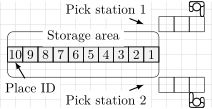
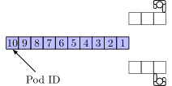

Overview
========
In this tutorial we will load problem settings of a pod repositioning problem,
create a solver, and store the solution to a JSON file.

Load Problem Settings
---------------------
First we need to include all necessary python modules. If the *prp* module is
not installed in any standard python directory we need to adjust the search path

.. literalinclude:: ../../examples/use-custom-solver.py
    :lines: 29-30

before import the modules.

.. literalinclude:: ../../examples/use-custom-solver.py
    :lines: 31-36

Now we define a function which will load a warehouse problem from json files.

.. literalinclude:: ../../examples/use-custom-solver.py
    :pyobject: load_problem
    :lines: 1

We load an empty layout from a JSON file *../data/10-layout.json* with  prp.xy.Layout().
The JSON file contains coordinates of places and stations. Layout() reads this
file and creates a corresponding empty warehouse. You can also you the Layout()
class to derive costs from the layout. In this case the costs are Manhattan distances between
the place and the places.

    Warehouse layout.

.. literalinclude:: ../../examples/use-custom-solver.py
    :pyobject: load_problem
    :lines: 3-8

We fill the warehouse with pods. We use positions of pods stored
in *../../examples/use-custom-solver.py*.

    Initial positions of the pod.

.. literalinclude:: ../../examples/use-custom-solver.py
    :start-at: with open("../data/10-initial-state.json", 'r')
    :end-at: recorder.load_initial_state_from_json

Finally we load a sequence of departures from *"../data/10-departures.json"*
and return the warehouse. (The departures are sequences of tuples (place,stations) ).

.. literalinclude:: ../../examples/use-custom-solver.py
    :start-at: with open("../data/10-departures.json", 'r')
    :end-at: return warehouse

Create custom solver
--------------------
We create a class MySolver. It will send a pod to a free place with the smallest
costs. On initalization, we will save a reference to our warehouse, because we
will frequently use it.

.. literalinclude:: ../../examples/use-custom-solver.py
    :pyobject: MySolver
    :lines: 1,4-5

The method *decide_new_place()* tells where to send a pod which leaves
a picking station. If no pod leaves the system, *decide_new_place()* returns (*INVALID_ID*,*INVALID_ID*). In this case we must return *INVALID_ID*.

.. literalinclude:: ../../examples/use-custom-solver.py
    :pyobject: MySolver.decide_new_place
    :lines: 1,3,6-7

Otherwise, check all available places in for the next decision and select
one with the smallest costs from picking station to the place. Before
return our decision, we print some debugging information.

.. literalinclude:: ../../examples/use-custom-solver.py
    :pyobject: MySolver.decide_new_place
    :lines: 9-

Run the warehouse
-----------------

We load our system and our solver.

.. literalinclude:: ../../examples/use-custom-solver.py
    :start-at: warehouse = load_problem() 
    :lines: 1-2

We will store our decisions in a list of places.

.. literalinclude:: ../../examples/use-custom-solver.py
    :start-at: solution = []
    :lines: 1

Now run the system step-wise until it finished. In each step, use our solver to decide were to put the current pods.

.. literalinclude:: ../../examples/use-custom-solver.py
    :start-at: while not warehouse.finished():
    :end-at: warehouse.next(place_id)

Finally print our results

.. literalinclude:: ../../examples/use-custom-solver.py
    :start-at: print("Total costs:
    :lines: 1

and store our solution to a JSON file.

.. literalinclude:: ../../examples/use-custom-solver.py
    :start-at: SOLUTION_FILE =
    :end-at: recorder.store_solution_to_json
