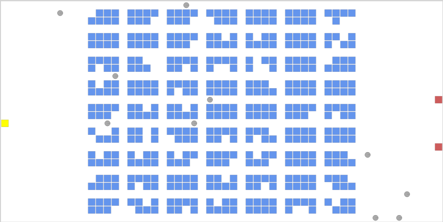
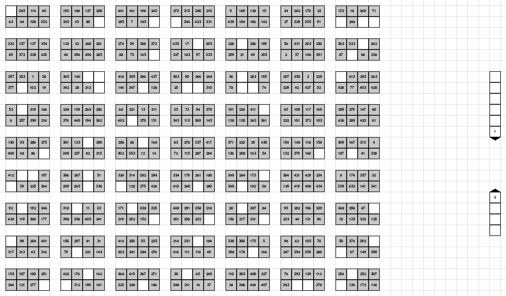

Convert RAWSim-O layout to PRP Layout.
======================================

Here we will convert a RAWSim-O_  \*.xinst file into PRP JSON files:

.. _RAWSim-O: https://github.com/merschformann/RAWSim-O

* Initial state file.  It contains the initial positions of the pods.
* Costs: They contain shortest distances from a station to a place, when a robot carries a pod.
* xy Layout file. It contains x-y positions of places and picking-station queues and can be read by :mod:`prp.xy` modules.

    RAWSim-O Layout

   PRP xy layout

We include all the required packages.

.. literalinclude:: ../../examples/convert-rawsimo-file.py
    :lines: 22-27

We define the path to the RAWSim-O file

.. literalinclude:: ../../examples/convert-rawsimo-file.py
    :lines: 31

We write the resulting PRP (Pod Repositioning Problem) JSON files to:

.. literalinclude:: ../../examples/convert-rawsimo-file.py
    :lines: 33-36

For the PRP mathematical model, we need to define the size of the station queues explicitly. For our problem, we choose to use different queue sizes.

.. literalinclude:: ../../examples/convert-rawsimo-file.py
    :lines: 38,39

Load RAWSim-O file. And get a corresponding warehouse model. The conversion may take several seconds, because the computation is computation intensive.

.. literalinclude:: ../../examples/convert-rawsimo-file.py
    :lines: 45

We can already store the initial state of the mathematical model and the costs.

.. literalinclude:: ../../examples/convert-rawsimo-file.py
    :lines: 48,49,53,54

Finally we can create a PRP layout, where the places and stations have cartesian xy-coordinates.

The coordinates of the places are obtained automatically from the RAWSim-O file, but the stations -- we need to create them manually.
We first create the stations outside of the layout.

.. literalinclude:: ../../examples/convert-rawsimo-file.py
    :lines: 61,62

Then we :meth:`prp.LayoutGrpah.get_xy_layout` will move these station on top of
the RAWSim-O stations. In the resulting xy-layout the coordinates of the heads of the XYStations are the same as the positions of the stations in the RAWSim-O file.

.. literalinclude:: ../../examples/convert-rawsimo-file.py
    :lines: 61,63

We can now store the xy PRP Layout.

.. literalinclude:: ../../examples/convert-rawsimo-file.py
    :lines: 65,66
