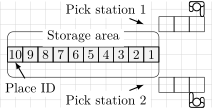
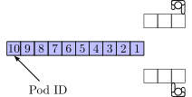

.. _small-test-system:

Small test system
=================

Every Pod Reposition Problem consists of warehouse properties, the initial
state of the warehouse and pods departures. In this tutorial we will
create a small test system to test different solvers.

This small system has 10 places, 10 pods and two pick stations with queue
length three as in the picture below:

.. _layout-image:

    Warehouse layout.

.. literalinclude:: ../../examples/generate-problem-settings-10.py
    :lines: 44-46

Then we will generate 1000 random departures of the pods from
the storage area to the pick stations.

We save this information in JSON file.

.. literalinclude:: ../../examples/generate-problem-settings-10.py
    :lines: 39-42

Before we start we import all the necessary modules

.. literalinclude:: ../../examples/generate-problem-settings-10.py
    :lines: 28-35

Layout
------
First we generate the layout of the system. We start with the storage
area. It is one-dimensional and consists of multiple square places
ordered from right to left.
The size of each place is 1x1. Thus length of the storage area is the number
of places in the system.

.. literalinclude:: ../../examples/generate-problem-settings-10.py
    :lines: 58-59

.. _initial-state-image:

    Initial positions of the pod.

The places has an unique ID and x-y-coordinates. We order the places by their IDs from right to left, as it shown on the :ref:`picture <initial-state-image>` above. The highest ID has coordinates (0,0).

.. literalinclude:: ../../examples/generate-problem-settings-10.py
    :lines: 62-64

We symmetrically add two pick stations right from storage area [#f1]_.
One above and one below. See :ref:`layout picture<layout-image>`. Every pick station, is a
queue where pods wait to be processed. In the both queues, the heads of
the queue are o the right side.

.. literalinclude:: ../../examples/generate-problem-settings-10.py
    :lines: 67-72

Pods, costs and the initial state
---------------------------------
From our layout we can already derive some important parameters:
the set of places, the set of stations, and the queue station:

.. literalinclude:: ../../examples/generate-problem-settings-10.py
    :lines: 75

As the costs, we use manhattan distances between the places and the heads
of the stations. That is
:math:`|x_\text{place}-x_\text{station head}| + |y_\text{place}-y_\text{station head}|`.

It is possible to enter these costs separately for every place and every station, but
instead, we use Manhattan distances calculated by Layout.get_costs().

.. literalinclude:: ../../examples/generate-problem-settings-10.py
    :lines: 77

We add 10 pods to storage area, such that pod 10 is on place 10, pod 9 is on place 9,
and so on.

.. literalinclude:: ../../examples/generate-problem-settings-10.py
    :lines: 81-83

Departures
----------
Before we start to optimize the system, we need to know, which pods will go to
which picking stations. This information is stored as *departures*. It is a sequence
of destinations tuples (pod, station) from time :math:`0` to maximal time

.. literalinclude:: ../../examples/generate-problem-settings-10.py
    :lines: 48

For each departure we randomly select a pod in storage area
and a station according to their weights.
For our example, we want to have pods which we use very frequently and pods
which we use very seldom. For the frequent ones we use larger weights,
for the rare ones we use smaller weights. There are many select the pod weights,
for simplicity we use the truncated geometric distribution. That means

:math:`weight(ID) = q^{(ID-1)}\cdot weight(1)`

with some parameter :math:`q`. We calculate the parameter :math:`q` in such
a way, that the quotient of the most frequent pod 1 is 20 times larger than
the weight of the less frequent pod 10.

:math:`\frac{weight(10)} {weight(1)}=20`

As for the pick stations in our example, we choose them with
equal probabilities.

.. literalinclude:: ../../examples/generate-problem-settings-10.py
    :lines: 50

Now we use both pod and station weights to create a random generator of 1000
pod departures.

.. literalinclude:: ../../examples/generate-problem-settings-10.py
    :lines: 86,88

Finally, we add a departure generator to the warehouse. We can add
the departure generator directly to the warehouse with::

    warehouse.set_departure_generator(generator)

but instead, we put a special recorder generator between the actual departures
and the warehouse. We use this recorder to store departures and store them
to a JSON file.

.. literalinclude:: ../../examples/generate-problem-settings-10.py
    :lines: 91-92

Generate and store data
-----------------------
Before we will generate data, we store the layout and costs.
If we also want to store initial state, we need to need to store it
before running the warehouse.

If the distination directories do not exists, we can  create them
*create_missing_directories_of_file* from *utils* module. For example:

.. literalinclude:: ../../examples/generate-problem-settings-10.py
    :lines: 95, 101, 106

Then we can save the data to files:

.. literalinclude:: ../../examples/generate-problem-settings-10.py
    :lines: 96-97, 102-103, 107-108

To create departures we must run the system until the departure generator
is empty. In order to be able to run a system, we need a solver.
It does not matter which solver we will use, because every solver generates the same departure
stream. We select some simple solver, because it is very fast.

.. literalinclude:: ../../examples/generate-problem-settings-10.py
    :start-at: solver =
    :end-at: warehouse.next(place_id)
    :lines: 1, 4-6

After the system have run for MAX_TIME time steps, the departures are
stored in departure_recorder. We can now store them to a JSON file.

.. literalinclude:: ../../examples/generate-problem-settings-10.py
    :start-at: utils.create_missing_directories_of_file(DEPARTURES_FILE)
    :end-at: departure_recorder.store_to_json

Now we have all data to run our first experiments.

.. rubric:: Footnotes

.. [#f1] We add the station in such a way that for any place the distance
   to the first and to the second station is the same. And the distances
   from a place with lower ID is smaller than the distances from a place
   with higher IDs.

For a mathematical model of the Pod Reposition Problem we need a set of pods,
a set of places, a set of pick stations, lengths of the queues at the
pick stations, costs, the initial state and the sequence of departures.
